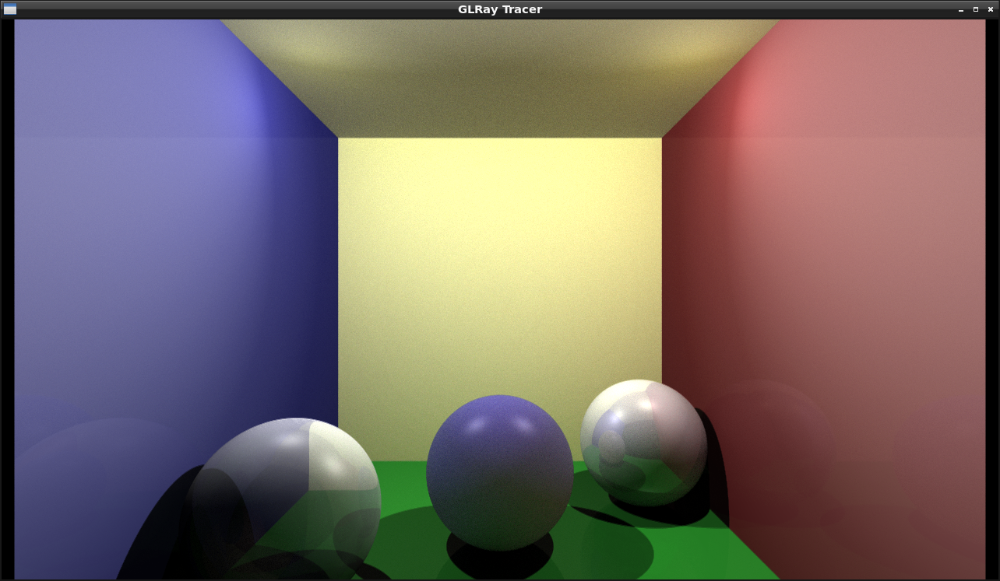

# GLRay Tracer

A ray tracer implemented in the fragment shader of modern opengl using C++

# Dependences:
* [GLFW](https://github.com/glfw/glfw)
* [GLAD](https://github.com/Dav1dde/glad)
* [GLM] (https://github.com/g-truc/glm)

To get all the dependencies without installing them on your system, run the file getdeps.  This is will clone each of the repositories linked above, make them, and copy the needed files to the deps directory:
```
chmod +x getdeps
./getdeps
```
So far this application only works on linux but I will take a look at extending it to other platforms.  Currently, the program produces this output in a GLFWwindow.

